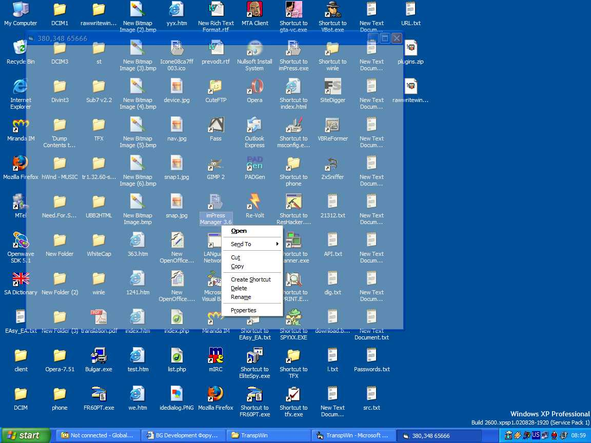



## A "layered" window \(Pre\-Alpha version\!\)

### Description

A transparent window which stays on the top of the desktop icons and allows you to click them.

At the current stage you can only click/dblclick on the icons, but don't forget -- this is just the first version. In the next release you will be able to manipulate all windows in the sysem.

Please vote for me if you like the code and its conception! :-))
 
### More Info
 

             |
---                |---
**Submitted On**   |2004-08-05 15:44:02
**By**             |[George Smilianov](https://github.com/Planet-Source-Code/PSCIndex/blob/master/ByAuthor/george-smilianov.md)
**Level**          |Beginner
**User Rating**    |4.8 (77 globes from 16 users)
**Compatibility**  |VB 6\.0
**Category**       |[Custom Controls/ Forms/  Menus](https://github.com/Planet-Source-Code/PSCIndex/blob/master/ByCategory/custom-controls-forms-menus__1-4.md)
**World**          |[Visual Basic](https://github.com/Planet-Source-Code/PSCIndex/blob/master/ByWorld/visual-basic.md)
**Archive File**   |[A\_\_layered177836852004\.zip](https://github.com/Planet-Source-Code/george-smilianov-a-layered-window-pre-alpha-version__1-55388/archive/master.zip)

